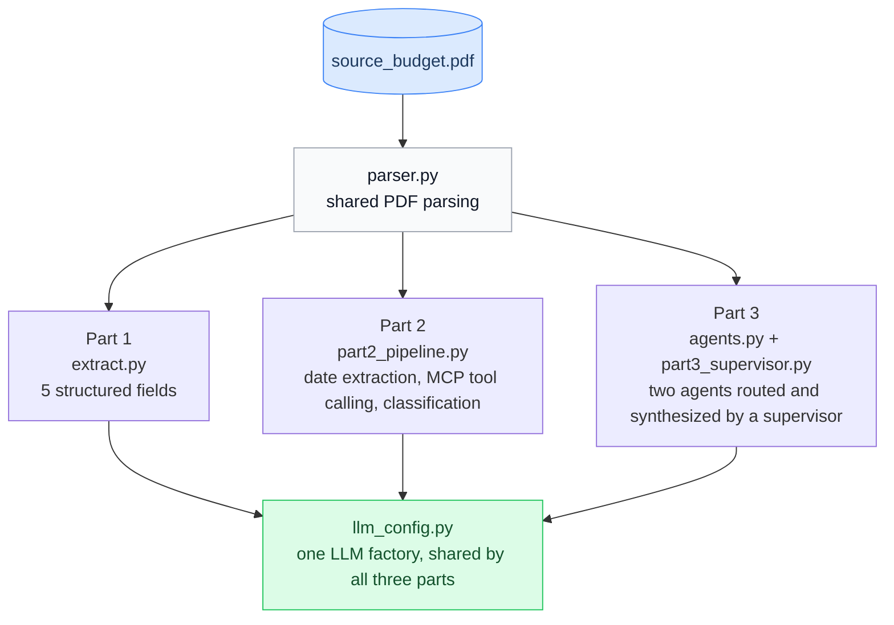

<div align="center">

# Fiscal Graph

<em>Structured extraction, tool-calling, and a multi-agent supervisor over a government budget document.</em>

<p>
  
  &nbsp;
  
  &nbsp;
  
  &nbsp;
  
  &nbsp;
  
</p>

<p>
  <a href="#setup">Setup</a> &nbsp;•&nbsp;
  <a href="#how-to-run-each-part">Run</a> &nbsp;•&nbsp;
  <a href="#system-design">Design</a> &nbsp;•&nbsp;
  <a href="#part-1-document-extraction-and-prompt-engineering">Part 1</a> &nbsp;•&nbsp;
  <a href="#part-2-tool-calling-and-reasoning">Part 2</a> &nbsp;•&nbsp;
  <a href="#part-3-multi-agent-supervisor">Part 3</a> &nbsp;•&nbsp;
  <a href="#interpretation-calls">Interpretation calls</a> &nbsp;•&nbsp;
  <a href="#cross-model-behavior">Model evaluation</a>

</div>

---

Three parts, one pipeline: parse the source PDF once, then extract structured fields (Part 1),
normalize and reason over dates through real tool calls (Part 2), and route a query across two
specialized agents under a supervisor (Part 3). Every result below is confirmed against a real
Anthropic API run, not asserted from code review.

**Source document**: [fy2024_analysis_of_revenue_and_expenditure.pdf](https://isomer-user-content.by.gov.sg/153/20f8e128-58fa-44ea-a109-f2dec3995271/fy2024_analysis_of_revenue_and_expenditure.pdf)
(Ministry of Finance, Singapore). A plain `curl` or `requests` GET against that URL returns a 403
from CloudFront; it needs a browser User-Agent header to fetch.

## Setup

```bash
python -m venv .venv
source .venv/Scripts/activate   # .venv/bin/activate on macOS/Linux
pip install -r requirements.txt
cp .env.example .env
```

Fill in `.env` with one or both keys:

| Key | Used for |
|---|---|
| `OPENROUTER_API_KEY` | Any OpenRouter model, including free-tier ones. Used during development to iterate at no cost. Change the model with `DEV_MODEL` (default: `google/gemma-4-31b-it:free`). |
| `ANTHROPIC_API_KEY` | The Haiku and Sonnet runs that produced the results documented below. |

Only one is strictly required, depending on which model you run. `llm_config.py` is the single
factory both paths go through.

## How to run each part

Every notebook already contains executed output. Read the results without running anything, or
re-execute:

```bash
jupyter nbconvert --to notebook --execute --inplace part1_extraction.ipynb
jupyter nbconvert --to notebook --execute --inplace part2_tools_reasoning.ipynb
jupyter nbconvert --to notebook --execute --inplace part3_multiagent.ipynb
```

Or run the underlying scripts directly:

```bash
python extract.py              # Part 1
python part2_pipeline.py       # Part 2
python part3_supervisor.py     # Part 3: runs all 4 demo queries, writes trace.json
```

## Repository structure

| File | Purpose |
|---|---|
| `parser.py` | PDF parsing. PyMuPDF for prose pages, pdfplumber table mode plus an artifact filter for tables. Used by all three parts. |
| `schemas.py` | Pydantic models for every structured output used across the three parts. |
| `llm_config.py` | LLM factory. Routes to OpenRouter for free dev models or direct Anthropic for Haiku/Sonnet, from one call site. |
| `extract.py` | Part 1 extraction. |
| `part1_extraction.ipynb` | Part 1 notebook, executed, with a verification table against ground truth. |
| `tools/datetime_core.py` | Part 2's date-normalization logic, deterministic. |
| `tools/datetime_mcp.py` | Part 2's local MCP server exposing that logic as a tool. |
| `tools/datetime_fallback.py` | Same tool as a plain LangChain `@tool`, used if MCP is unavailable. |
| `tools/mcp_client.py` | Connects to the MCP server as a subprocess and exposes it as a LangChain-bindable tool. |
| `part2_pipeline.py` | Part 2 pipeline: extraction, tool-calling normalization (MCP primary), classification. |
| `part2_tools_reasoning.ipynb` | Part 2 notebook, executed, with a synthetic robustness check for one branch not covered by real data. |
| `agents.py` | Part 3's Revenue Agent and Expenditure Agent. |
| `part3_supervisor.py` | Part 3 supervisor, trace capture, four demo queries. |
| `part3_multiagent.ipynb` | Part 3 notebook, executed, with an automated verification cell and a routing-pattern summary. |
| `trace.json` | Full captured trace for all four Part 3 demo queries. |
| `data/source_budget.pdf` | The source document, kept in the repo so the pipeline is reproducible without a fresh download. |
| `tests/` | Unit tests for the parts of the pipeline that don't need an LLM call to verify: PDF parsing, date normalization, schema validation. |
| `.github/workflows/test.yml` | Runs `tests/` on every push. No API keys involved. |

## System design



`parser.py`, `schemas.py`, and `llm_config.py` are built once in Part 1 and reused unchanged by
Parts 2 and 3. Part 3's agent tools call the same `parser.py` functions Part 1 uses, scoped to
different pages per agent. It is one pipeline from PDF to structured answers, not three separate
scripts.

Two external APIs are used, both behind `llm_config.get_llm()`: OpenRouter's OpenAI-compatible
endpoint for free development models, and Anthropic's Messages API directly for the Haiku and
Sonnet runs whose results are documented below. Nothing else is called at runtime. The source PDF
is fetched once, manually, into `data/` rather than re-downloaded on every run.

**Cost.** Development iteration ran on a free OpenRouter model at no cost. The verified runs used
Haiku ($1 / $5 per million input/output tokens) for Parts 1 and 2, and Sonnet ($2 / $10 per
million tokens) for all of Part 3 and a set of Part 1 comparison runs (see row 6 of
[Interpretation calls](#interpretation-calls)). Prompt sizes are small, a few thousand tokens at
most per call, so any individual run costs a fraction of a cent. Total spend across every
verified run and re-run during development stayed well under $1. A separate, wider model
comparison (8 models, including Gemini and 5 free OpenRouter models, documented in
[MODEL_EVALUATION.md](MODEL_EVALUATION.md)) ran entirely on free tiers, at $0, and is not part of
this cost total.

## Dependencies

| Library | Why it's here |
|---|---|
| `pymupdf` | Text-layer extraction for prose pages. Fast, correct reading order. |
| `pdfplumber` | Table-aware extraction for tabular pages. Detects bordered tables cell by cell instead of reconstructing structure from a flat text dump (see the page 8 artifact finding in Part 1). |
| `langchain`, `langchain-openai` | Structured output and tool binding, used the same way in all three parts. `langchain-openai`'s `ChatOpenAI` talks to OpenRouter. |
| `langchain-anthropic` | Direct Anthropic access for the Haiku/Sonnet runs. |
| `pydantic` | Every schema in `schemas.py` is a Pydantic model, so structured output is type-checked rather than parsed from raw JSON strings. |
| `langgraph`, `langgraph-supervisor` | Part 3's agent framework: `create_react_agent` for the two sub-agents, `create_supervisor` for routing and synthesis. |
| `mcp` | The local MCP server for Part 2's datetime tool. Pinned to `1.30.0` because `langchain-mcp-adapters` requires `mcp<2.0.0`; v2's `FastMCP` rename would otherwise break on a later minor bump. |
| `langchain-mcp-adapters` | Turns the MCP server into a tool an LLM can call through `.bind_tools()`, instead of Python code calling it directly. |
| `python-dateutil` | Deterministic date parsing for `tools/datetime_core.py`. Not LLM-based, on purpose: once a date string is located, converting it to ISO format is parsing, not reasoning. |
| `python-dotenv` | Loads `.env` so API keys stay out of source and out of git. |
| `jupyter` | Runs the three notebook deliverables. |
| `pytest` | Runs `tests/`, the unit tests for the deterministic parts of the pipeline. |

Every version above is pinned exactly, not just constrained, captured from a known-working
install. A clone six months from now installs the same thing rather than whatever the latest
compatible resolver picks.

## Tests

`tests/` covers the parts of the pipeline that don't need a live LLM call to verify: PDF parsing
(`test_parser.py`: known text lands on the pages it's supposed to, and the page 8 artifact stays
stripped), date normalization (`test_datetime_core.py`), and schema validation
(`test_schemas.py`: bad input is rejected, not just that good input is accepted). 18 tests, no
API key required, runs in a few seconds:

```bash
pytest tests/ -v
```

`.github/workflows/test.yml` runs the same command on every push.

## Part 1: Document Extraction and Prompt Engineering

### Parsing approach

Two extraction modes, chosen by page content rather than one blanket approach:

- `pymupdf` (`parser.get_prose_text`) for narrative pages, such as 5-6 and 18.
- `pdfplumber` (`parser.get_table_text`) for pages centered on tables: 8, 16, 20.

pdfplumber was chosen for tables because it can detect a bordered table and pull it out cell by
cell, which holds up better than reconstructing structure from a flat text stream. That
distinction mattered in practice. Page 8's raw text layer contains a stray line, `22,376,` /
`23,480,570,` / `22,915, 0`, sitting between two real rows of Table 1.1. It's a rendering
artifact, not real data: every genuine figure in this document is formatted as `$X.XX billion`,
never comma-thousands. A plain text dump hands the artifact straight to the model. `get_table_text`
filters it out with a regex scoped to that exact pattern, verified to remove the artifact while
leaving every real number on the page untouched.

pdfplumber's own table detector finds no bordered table at all on pages 8 or 16 (this document's
tables have no ruling lines), so it silently falls back to raw text on both. That's where the
artifact filter above does its work. Page 20 has a detectable bordered table and goes through
pdfplumber's native table extraction.

### Extraction

`extract.py` builds one combined context from pages 5-6 (prose) and 8, 16, 20 (table mode), then
extracts all five required fields in a single call using
`.with_structured_output(RevenueExtraction)`. The system prompt states explicitly that the source
document has both a "Revised FY2023" and an "Estimated FY2024" column side by side in its tables,
and that these are different numbers.

### Results

| Field | Value | Source |
|---|---|---|
| Corporate Income Tax 2024 | $28.03 billion | Table 2.1, page 16 |
| YoY % change, CIT 2024 | -1.2% | Table 2.1, page 16 |
| Total top-ups 2024 | $20.352 billion | Table 2.4, page 20 |
| Operating Revenue taxes | 12-item list, matches source exactly | Pages 5-6 |
| Latest Actual Fiscal Position | -$3.57 billion | Table 1.1, page 8, "Revised FY2023" |

Confirmed on `claude-haiku-4-5-20251001`.

The fiscal position field has two defensible readings, not one; both are reported in row 1 of
[Interpretation calls](#interpretation-calls), with -$3.57 billion used as the pipeline's primary
output.

**A citation error in the task brief.** It cites page 5 for the Corporate Income Tax 2024 figure
and its YoY change. Page 5 is the "Update on Financial Year 2023" section: its figures ($28.38
billion, +17.0%) are Revised FY2023, not FY2024. The correct FY2024 estimates, $28.03 billion and
-1.2%, are on page 16, Table 2.1. Confirmed by reading the source PDF directly, not assumed. The
pipeline pulls from the correct page regardless of which page the brief names.

### Assumptions

1. **Units.** The task specifies `float` for the CIT and top-ups fields but no unit. Both are
   reported in $ billion, matching the document's own primary unit: its tables are titled
   "$billion," and the top-ups table itself is in $ million and was converted.
2. **Scope of "taxes mentioned in the Operating Revenue section."** The narrative prose on pages
   5-6 (section 1.2, "Operating Revenue") names only 7 taxes in running sentences, the ones whose
   collections moved enough that year to be called out individually. The complete list lives in
   the table instead: every row under the "OPERATING REVENUE" header in Table 1.1/2.1 (pages
   8/16), 12 tax rows once "Fees and Charges" and "Others" are excluded (neither is a tax). That
   table-derived 12-item list is what the pipeline outputs and what ground truth checks against.
   One early test run against a different page window returned the 14-item version, including
   the two non-tax rows, before the tax-only scope was pinned down.

## Part 2: Tool Calling and Reasoning

### Approach

`part2_pipeline.py` extracts the raw date text from pages 1 and 36, normalizes it to ISO 8601
through a real tool call, then classifies each date against the reference date `2024-01-01`.

The normalization logic lives in one place, `tools/datetime_core.py`, using `python-dateutil`.
This is deliberately not LLM-based: once a date string is located, turning it into ISO format is
parsing, not reasoning. Two wrappers sit on top of that single implementation, so they can't
drift apart from each other:

- `tools/datetime_mcp.py`: a real local MCP server. `mcp` is pinned below v2 because
  `langchain-mcp-adapters` requires it; installing that package silently downgraded an unpinned
  `mcp>=2` install and broke the v2 API this file briefly used before the constraint was found.
- `tools/datetime_fallback.py`: the same logic as a plain LangChain `@tool`, used only if the MCP
  connection itself fails.

**Built real, then proven real.** The first working version of this pipeline had Python calling
`normalize_date` directly. MCP was wired up but sat unused, a prop rather than the actual path.
That was caught and rewired so the LLM calls the tool itself through MCP as primary. The rewire
immediately surfaced two real environment issues rather than zero: the `mcp` version pin above,
and the Jupyter `fileno` issue below. Both were diagnosed and fixed rather than papered over, and
the fallback path stayed in as a genuine second implementation, not a formality.

The pipeline goes through MCP first, not the fallback, matching the task's own wording: "via
local MCP... if you are not able to implement a local MCP, you may define as a function."
`part2_pipeline.py`'s `_get_normalize_tool()` connects to the server as a real subprocess, binds
its tool to the LLM with `.bind_tools()`, and lets the model decide to call it with arguments it
extracted itself. That is the actual difference between this and Python code calling a function
directly: the model decides to invoke the tool. Every run prints which path, `mcp` or `fallback`,
actually executed.

Both dates are sent to the model in a single call, labeled `Date 1` / `Date 2`, rather than one
call per date. Claude supports parallel tool use by default, so one response can carry two
`tool_calls`. Confirmed directly, not assumed: a single `.invoke()` returns an `ai_msg` with
`len(ai_msg.tool_calls) == 2`, one per date, each with the correct `raw_text` argument. The
pipeline runs 3 LLM calls total (extract, normalize, classify), not 4.

One environment detail worth flagging directly: from a plain Python process, the MCP path runs
and is confirmed (`tool source: mcp`). Inside the Jupyter kernel used to execute
`part2_tools_reasoning.ipynb`, the same connection fails with `UnsupportedOperation('fileno')`,
because Jupyter replaces stdin/stdout with objects that don't expose the file descriptors the
stdio transport needs. The fallback runs instead, automatically, with the same result. Both paths
are exercised and verified separately; this is the fallback doing its job, not a failure being
hidden.

### Results

| Text | Normalized | Status |
|---|---|---|
| "Distributed on Budget Day: 16 February 2024" | 2024-02-16 | Upcoming |
| "Estate Duty does not apply to a person who dies after 15 February 2008." | 2008-02-15 | Expired |

The first row matches the task's own sample output exactly. Both confirmed on real Haiku, run
twice to check for determinism (temperature 0).

### Assumptions

The task description says to normalize "submission dates extracted in Part 1," but Part 1 has no
date fields at all. The two dates named here appear for the first time in Part 2 and are treated
as a continuation that extracts them directly, using the same pattern built for Part 1, rather
than assuming Part 1 already produced them.

The estate duty date is a policy cutoff, not a submission date. Against the reference date, a
literal reading says Expired: the date itself has passed. An alternative reading says Ongoing:
the policy state it describes is still in effect. Expired was used, as the more literal reading
of the field.

### One branch tested synthetically

Both real dates are single points in time, so neither exercises the third classification state,
Ongoing, which describes a period spanning the reference date. `part2_tools_reasoning.ipynb`
includes one clearly labeled synthetic case, a constructed period that does span the reference
date, to confirm the branch works. It's marked `[SYNTHETIC, not document-derived]` and isn't part
of the graded output above.

## Part 3: Multi-Agent Supervisor

### Architecture

Two agents, built with `create_react_agent`:

- **Revenue Agent**: one tool, `revenue_context()`, returning pages 5-6, 9, and 16.
- **Expenditure Agent**: one tool, `expenditure_context()`, returning pages 14, 17, 18, and 20.
  Page 18 matters specifically: it's the narrative that explains why the Future Energy Fund
  exists, not just the table row that gives its dollar amount.

`part3_supervisor.py` wires both agents under `create_supervisor(agents=[...], model=...,
prompt=..., output_mode="full_history")`. `output_mode="full_history"` is not the default; the
default, `"last_message"`, would keep only each agent's final one-line answer and lose the tool
calls that make the trace worth reading. `create_supervisor()` returns an uncompiled graph;
`.compile()` is called before use.

Both sub-agents and the supervisor run on Sonnet, chosen after comparing routing reliability
against Haiku sub-agents on the graded query.

**A routing bug, found and fixed.** The first version of `SUPERVISOR_PROMPT` missed
`expenditure_agent` on the task's exact graded query (reproducibly, 3/3 runs) because Revenue
Agent's own context happens to also mention the Future Energy Fund's dollar figure, and the
supervisor treated that as sufficient. The fix was an explicit rule in the prompt: a fund's
purpose or how it will be supported belongs to Expenditure Agent regardless of Revenue Agent's
incidental overlap. Re-run 3/3 clean after the fix, and the four-query trace above is from the
corrected prompt.

### Assumptions

1. **Tool design.** Each agent's tool returns a fixed, pre-scoped block of page text rather than
   searching the full document with an embedding index. The source is 37 pages with a page
   mapping already established in Part 1, and this part is graded on how the supervisor routes
   and synthesizes, not on retrieval sophistication. Building a retrieval layer here would solve
   a problem the task doesn't pose.
2. **Selective routing.** The supervisor is prompted to delegate only to the agent or agents an
   individual query actually needs, not both by default. That's a design choice, checked
   behaviorally below rather than just asserted.
3. **Which pages belong to which agent** is an interpretive call the task doesn't make for you.
   Pages were assigned by dominant topic: revenue narrative and tables to Revenue Agent,
   expenditure and fund top-ups to Expenditure Agent. Table 2.1 (page 16) and Table 2.4 (page 20)
   both list the Future Energy Fund as a line item, because the source document nests expenditure
   figures inside a broader budget summary table.
4. **"Key government revenue streams"** has no fixed count or cutoff in the query itself. Revenue
   Agent reports every line item visible in its context rather than picking an arbitrary top-N.

### Results

Trace-verified: read from the actual sequence of agents invoked, not inferred from whether the
final answer sounded right.

| Query | Agents invoked |
|---|---|
| The task's exact query (dual-agent) | Revenue Agent, Expenditure Agent |
| Revenue-only ("largest single source of revenue?") | Revenue Agent only |
| Expenditure-only ("GST Voucher Fund top-up?") | Expenditure Agent only |
| A second dual-agent query, different phrasing | Revenue Agent, Expenditure Agent |

The revenue-only and expenditure-only rows show the supervisor isn't reflexively calling both
agents on every query, in either direction. The two dual-agent rows, different phrasings of a
query that genuinely needs both, both route to both. The task's exact query gets the Future
Energy Fund figure right, $5.0 billion, sourced to "invest in critical infrastructure for the
energy transition," the actual wording from page 18. It also names revenue streams that match
Part 1's verified 12-item list, with nothing invented.

## Interpretation calls

Six places across this project have no single correct reading: the field name, the source
document, or the task text itself pulls in two directions at once. The first five are also
explained in prose in their own part above; this table lets them be scanned in one place instead
of hunted through three sections. Row 6 surfaced later, during a side-by-side Haiku/Sonnet
comparison, and is documented here for the first time.

| # | Decision | Candidate A | Candidate B | Chosen | Why |
|---|---|---|---|---|---|
| 1 | Latest Actual Fiscal Position (Part 1) | Actual FY2022: **$1.72B** (page 8, the only column literally labeled "Actual" anywhere in the document) | Revised FY2023: **-$3.57B** (page 8, one year more recent, built from real collected data) | **B, -$3.57B** | "Latest" points at the newer year. "Revised" reflects real outcomes, not a forecast, even though the document never stamps it "Actual." No column in the entire document is both newest and literally "Actual"; the two words in the field name can't both be satisfied at once. |
| 2 | CIT 2024 amount + YoY% source page (Part 1) | Page 5, as the brief literally cites: Revised FY2023 figures, $28.38B, +17.0% | Page 16: Estimated FY2024 figures, $28.03B, -1.2% | **B, page 16** | The field explicitly asks for "2024" figures. Page 5's own column header reads "Revised FY2023," a different year, regardless of which page number the brief names. |
| 3 | Operating Revenue tax list scope (Part 1) | Narrative-only: 7 taxes named in running prose, pages 5-6 (only the ones whose collections moved enough to get a sentence) | Table row labels: 12 tax items, pages 8/16 (14 if "Fees and Charges" and "Others" are included) | **12-item table list** | The field is titled "list of taxes." Fees and Charges and Others aren't taxes. The narrative names an arbitrary subset, whatever moved that year, not the section's full scope. |
| 4 | Estate duty date classification (Part 2) | Expired: the literal date, 15 Feb 2008, has passed | Ongoing: the policy state it describes ("does not apply to a person who dies after...") is still in effect today | **Expired** | The more literal reading of the date field itself, not the policy it describes. |
| 5 | "Dates extracted in Part 1" (Part 2) | Reuse Part 1's literal output; none exists, Part 1 has no date fields | Extract both named dates directly in Part 2, using the same extraction pattern Part 1 established | **Extract directly in Part 2** | Part 1's 5 fields are all financial figures, never dates. A literal reuse is impossible, so this is read as a continuation that performs its own extraction rather than a broken dependency. |
| 6 | Is "Statutory Boards' Contributions" a tax? (Part 1) | Exclude it: it's money a statutory board pays *to* government, not money government collects *from* taxpayers, the same category as the already-excluded "Fees and Charges" | Include it: it's listed under the same "OPERATING REVENUE" table header as every other tax row, and the field asks for what's "mentioned in" that section | **Include (12-item list, Haiku)** | Not a hypothetical: run twice on `claude-sonnet-5` with the same prompt and schema, both times excluding it (11 items) on the reasoning in Candidate A. `claude-haiku-4-5-20251001` includes it (12 items) both times. Gemini (`gemini-3.6-flash`), run against the same prompt and schema, was inconsistent between the two readings across repeated calls (10 and 12-item lists) rather than settling on either (see [MODEL_EVALUATION.md](MODEL_EVALUATION.md)), which is itself evidence this is a genuine ambiguity, not an error in any one model. The 12-item Haiku answer is kept as primary because all existing ground truth and tests were built around it, not because the Sonnet reading is wrong. |

## Cross-model behavior

The pipeline runs unchanged against four model backends behind `llm_config.get_llm()`: Sonnet
and Haiku direct via Anthropic, Gemini direct via Google, and any OpenRouter model (used as a
free dev-tier stand-in during iteration). Same prompts, same schemas, same code path: model
choice is a parameter, not a fork. Running the same pipeline across all four surfaced real,
reproducible differences in how each provider's API and model behave, independent of prompt
wording. Documented here rather than papered over with per-model branches in the pipeline code.

The table below covers Sonnet, Haiku, and Gemini. A wider comparison across 8 models total,
including 5 free open-weight models tried and rejected, with the specific, verifiable reason each
one failed, is in [MODEL_EVALUATION.md](MODEL_EVALUATION.md).

| Behavior | Sonnet | Haiku | Gemini (`gemini-3.6-flash`) | Why it matters |
|---|---|---|---|---|
| `temperature` parameter | Rejects it outright: a 400 error if passed at all, even `0`. `llm_config.py` omits the kwarg entirely when `temperature=None`. | Accepts `temperature=0` fine. | Accepts the kwarg without erroring, but silently ignores it; the API warns that this model "uses fixed sampling defaults." | Three different behaviors (reject / honor / silently ignore) for the identical parameter. A single call site can't assume any of the three without checking the model first. |
| Structured-output token budget | Reliably populates every required schema field at `max_tokens=3000`. | Same as Sonnet. | Silently dropped one required field out of five at `max_tokens=3000`; needed `6000` to populate all fields reliably. No error, no truncation warning: the response simply validated as incomplete. | A fixed `max_tokens` tuned against one provider is not a safe default for another. This is a real, reproduced failure, not a one-off. |
| Operating Revenue tax list (Part 1) | Excludes "Statutory Boards' Contributions": 11 items. | Includes it: 12 items. See [Interpretation calls](#interpretation-calls), row 6. | Included it, 12 items, matching Haiku. | Genuine disagreement about what counts as a "tax" under an ambiguous field name, not something a schema description alone resolved. |
| Supervisor routing selectivity (Part 3) | Correctly delegates to exactly the agent(s) a query needs, after the routing-prompt fix described in Part 3's Architecture section. | Not run as supervisor/agent model in the verified trace (Part 3 defaults to Sonnet for both roles; see Part 3 Assumptions). | Over-routed on the expenditure-only demo query (GST Voucher Fund top-up): called both `revenue_agent` and `expenditure_agent` when only the latter was relevant. The answer content was still correct; the inefficiency is in which agents got called, not what they said. | Routing precision is itself model-dependent, not just a property of the prompt. The same `SUPERVISOR_PROMPT` produces tighter routing on Sonnet than on Gemini. |

### Mitigations

Four changes close most of this gap for every model, without a single per-model branch anywhere
in the pipeline. A model that already gets it right on the first try (Sonnet, in every observed
run) never triggers any of them and pays no extra cost:

- **Generous, shared `max_tokens` headroom.** `max_tokens` is a cap, not a spend target, so raising
  it everywhere (`extract.py` 3000->8000, `part2_pipeline.py` and `agents.py` similarly doubled)
  costs nothing unless a model was actually being truncated, which is exactly what was happening
  to Gemini.
- **A generic retry on structured-output failure**, `retry_utils.py`'s `invoke_with_retry()`. It
  retries the identical call unchanged on either of two failure shapes actually observed live: an
  `OutputParserException` (Gemini's dropped field) or an `openai.LengthFinishReasonError` (an
  OpenRouter free model, `liquid/lfm-2.5-2.6b:free`, non-deterministically spending its whole token
  budget on hidden reasoning tokens before emitting any JSON; the same call succeeded cleanly
  moments earlier and failed this way the next time). It never inspects which model or which field
  failed, so it's schema-agnostic and model-agnostic by construction. Wired into every
  structured-output call site in Parts 1 and 2, plus the tool-call-count check in Part 2's date
  normalization.
- **A worked example in the Part 1 extraction prompt** showing which items belong in
  `operating_revenue_taxes` and which don't, plus an explicit "every field is required" line.
  Targets both the Gemini omission and the Haiku/Sonnet tax-count disagreement at once, since both
  are really the same problem: an ambiguous rule stated in prose only, not demonstrated.
- **A worked example in the Part 3 supervisor prompt** showing the exact routing boundary an
  expenditure-only query sits on, addressing the Gemini over-routing case directly.

Two further ideas exist as opt-in functions in `extract.py`, not defaults, since each adds LLM
calls: `run_extraction_consistent(n=3)` runs the extraction `n` times and merges by majority vote,
surfacing any per-field disagreement instead of silently picking one; `run_extraction_verified()`
adds a second self-check pass where the model reviews its own draft against the source context.
Neither changes any currently-documented result; they're available for a run where the extra cost
is worth the added robustness.

