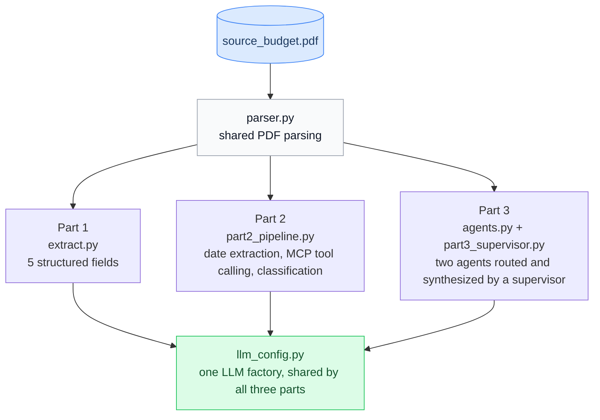

<div align="center">

# Fiscal Graph

<em>Structured extraction, tool calling, and a multi-agent supervisor over a government budget document.</em>

<p>
  
  &nbsp;
  
  &nbsp;
  
  &nbsp;
  
  &nbsp;
  
</p>

<p>
  <a href="#setup">Setup</a> &nbsp;•&nbsp;
  <a href="#part-1-document-extraction-and-prompt-engineering">Part 1</a> &nbsp;•&nbsp;
  <a href="#part-2-tool-calling-and-reasoning">Part 2</a> &nbsp;•&nbsp;
  <a href="#part-3-multi-agent-supervisor">Part 3</a> &nbsp;•&nbsp;
  <a href="#assumptions">Assumptions</a>

</div>

---

One pipeline, three parts, over one source document: Singapore's FY2024 Analysis of Revenue
and Expenditure. Part 1 extracts five structured fields from the PDF. Part 2 normalizes and
reasons over two dates using a real tool call. Part 3 routes a query across two specialized
agents under a supervisor. Parsing, schemas, and the LLM factory are built once and reused by
all three parts.

**Source document**: [fy2024_analysis_of_revenue_and_expenditure.pdf](https://isomer-user-content.by.gov.sg/153/20f8e128-58fa-44ea-a109-f2dec3995271/fy2024_analysis_of_revenue_and_expenditure.pdf)
(Ministry of Finance, Singapore). It is also kept in this repo at `data/source_budget.pdf`, so
the pipeline runs without a fresh download.

## Setup

```bash
python -m venv .venv
source .venv/Scripts/activate   # .venv/bin/activate on macOS/Linux
pip install -r requirements.txt
cp .env.example .env
```

Fill in `.env`:

| Key | Used for |
|---|---|
| `OPENROUTER_API_KEY` | Any OpenRouter model, including free-tier ones. Used for development iteration. Change the model with `DEV_MODEL`. |
| `ANTHROPIC_API_KEY` | The Haiku and Sonnet runs that produced the results documented below. |
| `GEMINI_API_KEY` | Optional. Only needed to run against Gemini directly; not required for the primary results. |

Only one is strictly required, depending on which model you run. `llm_config.py` is the single
factory every part goes through.

## How to run

```bash
python extract.py              # Part 1
python part2_pipeline.py       # Part 2
python part3_supervisor.py     # Part 3: runs four queries, writes trace.json
```

Or open the equivalent notebook for each part: `part1_extraction.ipynb`,
`part2_tools_reasoning.ipynb`, `part3_multiagent.ipynb`.

## Repository structure

| File | Purpose |
|---|---|
| `parser.py` | PDF parsing: PyMuPDF for prose pages, pdfplumber for tables. Used by all three parts. |
| `schemas.py` | Pydantic models for every structured output used across the three parts. |
| `llm_config.py` | LLM factory. One call site, routed by model id, to OpenRouter, Anthropic, or Google. |
| `retry_utils.py` | Retries a structured-output call once if the model's response doesn't validate. |
| `observability.py` | Logs one line per top-level call with elapsed time and outcome. |
| `extract.py` | Part 1: extraction, plus the fixed page citation for each field. |
| `part1_extraction.ipynb` | Part 1 notebook, executed, with a verification table. |
| `evaluate.py` | Runs Part 1 against a fixed set of known-correct values: `python evaluate.py`. |
| `tools/datetime_core.py` | Part 2's date-normalization logic. |
| `tools/datetime_mcp.py` | Part 2's local MCP server exposing that logic as a tool. |
| `tools/datetime_fallback.py` | The same tool as a plain LangChain `@tool`, used if MCP is unavailable. |
| `tools/mcp_client.py` | Connects to the MCP server as a subprocess and exposes it as a LangChain tool. |
| `part2_pipeline.py` | Part 2: extraction, MCP tool calling, classification. |
| `part2_tools_reasoning.ipynb` | Part 2 notebook, executed. |
| `agents.py` | Part 3's Revenue Agent and Expenditure Agent. |
| `part3_supervisor.py` | Part 3's supervisor, trace capture, four demo queries. |
| `part3_multiagent.ipynb` | Part 3 notebook, executed. |
| `trace.json` | Captured trace for all four Part 3 demo queries. |
| `data/source_budget.pdf` | The source document. |
| `tests/` | Unit tests for the parts of the pipeline that don't need a live LLM call. |
| `.github/workflows/test.yml` | Runs `tests/` on every push. |

## System design



`parser.py`, `schemas.py`, and `llm_config.py` are built once in Part 1 and reused unchanged by
Parts 2 and 3. Part 3's agent tools call the same `parser.py` functions Part 1 uses, scoped to
different pages per agent.

Every LLM call goes through `llm_config.get_llm()`, which bounds each call to 60 seconds and
retries once on a structured-output failure through `retry_utils.py`. Every extracted field in
Part 1 carries a fixed source page, returned by `extract.py`'s `field_sources()`, so a value can
be checked against the PDF directly.

## Dependencies

| Library | Why it's here |
|---|---|
| `pymupdf` | Text-layer extraction for prose pages. Correct reading order. |
| `pdfplumber` | Table-aware extraction for tabular pages, cell by cell rather than a flat text dump. |
| `langchain`, `langchain-openai` | Structured output and tool binding, used the same way in all three parts. |
| `langchain-anthropic` | Direct Anthropic access for the Haiku/Sonnet runs. |
| `langchain-google-genai` | Direct Google access for the Gemini path. |
| `pydantic` | Every schema in `schemas.py` is a Pydantic model, so structured output is type-checked. |
| `langgraph`, `langgraph-supervisor` | Part 3's agent framework: `create_react_agent` for the two sub-agents, `create_supervisor` for routing and synthesis. |
| `mcp` | The local MCP server for Part 2's datetime tool. Pinned below v2 for compatibility with `langchain-mcp-adapters`. |
| `langchain-mcp-adapters` | Turns the MCP server into a tool an LLM can call through `.bind_tools()`. |
| `python-dateutil` | Deterministic date parsing for `tools/datetime_core.py`. Not LLM-based: converting a located date string to ISO format is parsing, not reasoning. |
| `python-dotenv` | Loads `.env` so API keys stay out of source and out of git. |
| `pytest` | Runs `tests/`. |

Every version is pinned exactly, not just constrained.

## Tests

`tests/` covers the parts of the pipeline that don't need a live LLM call to verify: PDF parsing,
date normalization, schema validation, the retry helper, the citation mapping, and structured
logging. 28 tests, no API key required:

```bash
pytest tests/ -v
```

## Part 1: Document Extraction and Prompt Engineering

### Parsing approach

Two libraries, chosen per page type. PyMuPDF reads prose pages in their natural order. Pdfplumber
reads table pages cell by cell, which avoids a text-layer artifact confirmed on page 8: a stray
line of comma-formatted numbers interleaved with Table 1.1's real rows when that page is read as
plain text. `parser.py` strips that specific artifact pattern explicitly.

### Extraction

`extract.py` builds a prompt from the labeled page excerpts each field needs, and asks for
structured output validated against a Pydantic schema (`schemas.py`'s `RevenueExtraction`), so
the response is type-checked rather than parsed from a raw string.

### Results

Verified against the source PDF, using `claude-sonnet-5`:

| Field | Value | Source |
|---|---|---|
| Amount of Corporate Income Tax in 2024 | $28.03 billion | Table 2.1, page 16, Estimated FY2024 |
| YoY % difference of Corporate Income Tax in 2024 | -1.2% | Table 2.1, page 16 |
| Total amount of top-ups in 2024 | $20.352 billion | Table 2.4, page 20 |
| List of taxes in "Operating Revenue" | Corporate Income Tax, Personal Income Tax, Withholding Tax, Statutory Boards' Contributions, Assets Taxes, Customs Excise and Carbon Taxes, Goods and Services Tax, Motor Vehicle Taxes, Vehicle Quota Premiums, Betting Taxes, Stamp Duty, Other Taxes | Pages 5-6, 8, 16 |
| Latest Actual Fiscal Position | -$3.57 billion | Table 1.1, page 8, Revised FY2023 |

### Assumptions

- The brief cites page 5 for the Corporate Income Tax fields, asking for the 2024 figures. Page
  5 is Revised FY2023 narrative; the actual Estimated FY2024 figures, in the same table
  structure the brief describes, are on page 16 (Table 2.1). The field asks for 2024, so page 16
  is used.
- Page 8's "Latest Actual Fiscal Position" has three candidate columns: Actual FY2022, Revised
  FY2023, and Estimated FY2023. "Latest" points at the most recent year; "Actual" points at
  literally collected data rather than a forecast. No single column satisfies both words at once.
  Revised FY2023 is used, as the more recent year built from real collected data rather than the
  original forecast.
- The tax list is read from the table row labels on pages 8 and 16, not the narrative on pages
  5-6, since the narrative only names whichever taxes moved enough that year to get a sentence,
  not the section's full scope. "Fees and Charges" and "Others" appear under the same table
  header but are excluded, since neither is a tax.
- Whether "Statutory Boards' Contributions" counts as a tax is genuinely ambiguous: it is listed
  under the same header as every other tax row, but it is money paid to government rather than
  collected from taxpayers. It is included here.

## Part 2: Tool Calling and Reasoning

### Approach

`part2_pipeline.py` extracts the raw date text from pages 1 and 36, normalizes it to ISO 8601
through a real tool call, then classifies each date against the reference date `2024-01-01`.

The normalization logic lives in `tools/datetime_core.py`, using `python-dateutil`. Two
interfaces sit on top of it: `tools/datetime_mcp.py`, a local MCP server, and
`tools/datetime_fallback.py`, the same logic as a plain `@tool`, used only if the MCP connection
itself fails. The pipeline routes through MCP first. `part2_pipeline.py` connects to the server
as a real subprocess, binds its tool to the LLM with `.bind_tools()`, and lets the model decide
to call it with arguments it extracted itself.

Both dates are sent to the model in a single call, labeled `Date 1` / `Date 2`, so the model can
emit both tool calls in one turn rather than one call per date.

### Results

Step 1, list of normalized dates:

```json
["2024-02-16", "2008-02-15"]
```

Step 2, classified against `2024-01-01`:

```json
[
  {
    "original_text": "Distributed on Budget Day: 16 February 2024",
    "normalized_date": "2024-02-16",
    "status": "Upcoming"
  },
  {
    "original_text": "Estate Duty does not apply to a person who dies after 15 February 2008.",
    "normalized_date": "2008-02-15",
    "status": "Expired"
  }
]
```

### Assumptions

- The estate duty sentence describes a policy still in effect today, but the date itself, 15
  February 2008, has already passed relative to the reference date. It is classified by the
  literal date, not the ongoing policy it describes: Expired.
- Neither of the two real dates describes a currently active period, so the Ongoing branch has
  no real example in this document. It is covered by one synthetic, clearly labeled test case in
  `part2_tools_reasoning.ipynb`.

## Part 3: Multi-Agent Supervisor

### Architecture

Two agents, built with `create_react_agent`:

- **Revenue Agent**: one tool, returning the Operating Revenue narrative and its FY2024 table.
- **Expenditure Agent**: one tool, returning the Total Expenditure narrative, the fund top-up
  narrative (including why the Future Energy Fund exists), and its FY2024 table.

`part3_supervisor.py` wires both agents under `create_supervisor()`, with
`output_mode="full_history"` so the trace retains each agent's actual tool calls, not just its
final answer. Both agents and the supervisor run on `claude-sonnet-5`.

### The required query

> What are the key government revenue streams, and how will the Budget for the Future Energy
> Fund be supported?

The supervisor delegates to both agents and synthesizes one answer. Revenue Agent reports every
line item in Operating Revenue, led by Corporate Income Tax ($28.03 billion) and Goods and
Services Tax ($19.39 billion), plus the Net Investment Returns Contribution ($23.50 billion).
Expenditure Agent reports the Future Energy Fund's initial injection of $5.0 billion, sourced to
page 18's stated purpose: to invest in critical infrastructure for the energy transition.

### Additional queries

| Query | Agents invoked |
|---|---|
| "What is the largest single source of government revenue?" | Revenue Agent only |
| "How much is being spent on the GST Voucher Fund top-up, and why?" | Expenditure Agent only |
| "What is the largest source of tax revenue, and separately, what specific purpose will the Future Energy Fund infrastructure spending serve?" | Revenue Agent, Expenditure Agent |

The single-agent queries show the supervisor delegating only to the agent a query actually
needs, in both directions. The two differently-phrased dual queries both route to both agents
and synthesize a complete answer.

### Assumptions

- Each agent's tool returns a fixed, pre-scoped block of page text rather than searching the
  full document with an embedding index. The source is 37 pages with a page mapping already
  established in Part 1, and this part is graded on how the supervisor routes and synthesizes,
  not on retrieval sophistication.
- Which pages belong to which agent is an interpretive call the task doesn't make directly.
  Pages are assigned by dominant topic: revenue narrative and tables to Revenue Agent,
  expenditure and fund top-ups to Expenditure Agent.
- "Key government revenue streams" has no fixed count or cutoff in the query itself. Revenue
  Agent reports every line item visible in its context rather than picking an arbitrary top N.

### Trace

`trace.json` records, for every query, the full ordered sequence of messages: the supervisor's
delegation calls, each agent's tool calls and tool results, and the final synthesized answer.
`part3_supervisor.py`'s `print_trace()` renders the same sequence to the console. The actual
recorded sequence for the required query above:

```
[1]  user            -> "What are the key government revenue streams, and how will
                          the Budget for the Future Energy Fund be supported?"
[2]  supervisor      -> calls transfer_to_revenue_agent
[3]  revenue_agent   -> calls its revenue_context tool
[4]  revenue_context -> returns pages 5, 9, 16
[5]  revenue_agent   -> answers: Operating Revenue $108.64B, led by Corporate
                          Income Tax $28.03B and GST $19.39B
[6]  revenue_agent   -> transfers back to supervisor
[7]  supervisor      -> calls transfer_to_expenditure_agent
[8]  expenditure_agent   -> calls its expenditure_context tool
[9]  expenditure_context -> returns pages 14, 17, 18, 20
[10] expenditure_agent   -> answers: Future Energy Fund, $5.0B initial injection,
                          purpose per page 18: "invest in critical infrastructure
                          for the energy transition"
[11] expenditure_agent   -> transfers back to supervisor
[12] supervisor      -> synthesizes both answers into one final response
```

This is the actual message sequence from `trace.json`, condensed for readability; tool-call IDs
and raw page text are omitted here but present in the file.

## Assumptions

A few places in this project have no single correct reading from the task text or the source
document alone. Each is resolved and stated here, in addition to the per-part assumptions above.

| # | Decision | Chosen | Why |
|---|---|---|---|
| 1 | Latest Actual Fiscal Position source column | Revised FY2023, -$3.57 billion | "Latest" and "Actual" cannot both be satisfied by one column in this document; see Part 1 Assumptions. |
| 2 | Corporate Income Tax 2024 source page | Page 16, not page 5 | The field asks for 2024 figures; page 5 is FY2023. |
| 3 | Operating Revenue tax list scope | The 12-item table row list, not the narrative subset | The field is titled "list of taxes"; the narrative only names whichever items moved that year. |
| 4 | Estate duty date classification | Expired | The literal date has passed, independent of the policy's current effect. |
| 5 | "Dates extracted in Part 1" | Extracted directly in Part 2 | Part 1's five fields are all financial figures; there is no Part 1 date output to reuse. |
| 6 | Whether "Statutory Boards' Contributions" is a tax | Included | It sits under the same table header as every other tax row; a stricter reading (money paid to, not collected from, government) would exclude it. Both are defensible; the inclusive reading is used. |
